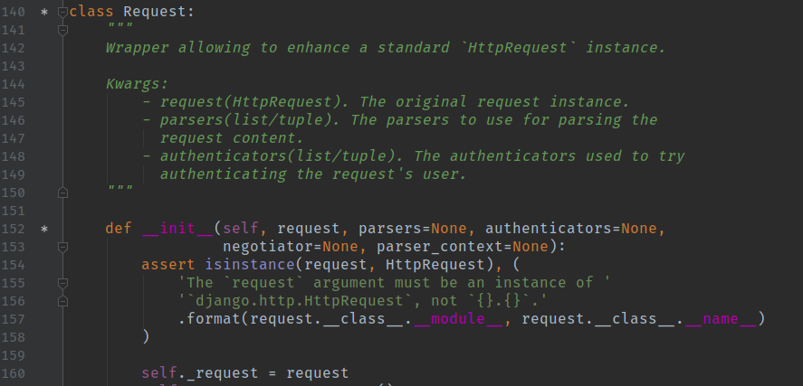
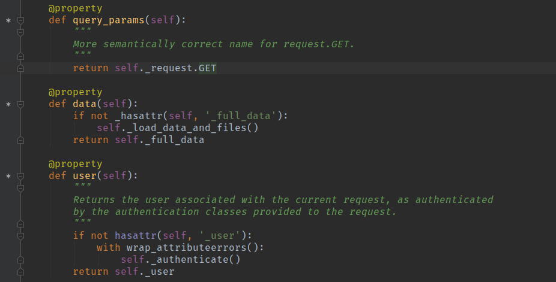

# request

- `rest_framework.request.Request` 对象
- 扩展了`django.http.HttpRequest`对象(注意：是扩展而不是继承)
- 实例化时需要传入一个`django.http.HttpRequest`的对象
- 提供了一些常用的属性
    - request._request, 原生的`django.http.HttpRequest`对象
    - request.query_params, 等同于django中的request.GET, 用来获取url query中的参数
    - request.data, 等同于的django中的request.FILES + request.POST，用来获取request body中的参数
    - request.user, 返回当前请求的用户(请求用户通过了身份认证， 没有通过身份认证就返回一个匿名用户)
    - request.method, 返回当前的HTTP请求方法(全字母大写)

- 上面属性的部分源码
- 
- 

## 简单示例

```python
from rest_framework import viewsets
from rest_framework.request import Request
from rest_framework.response import Response


class RequestViewSet(viewsets.ViewSet):
    def list(self, request, *args, **kwarg):
        data = {
            'is_request_isinstance': isinstance(request, Request),
            'query_params': request.query_params,
            'data': request.data,
            'method': request.method,
            'user': str(request.user)
        }

        return Response(data)

    def create(self, request, *args, **kwargs):
        data = {
            'is_request_isinstance': isinstance(request, Request),
            'query_params': request.query_params,
            'data': request.data,
            'method': request.method,
            'user': str(request.user)
        }
        return Response(data)
```

- GET "http://127.0.0.1:8000/api/request/?name=xxx&age=22"
- 返回参数

```json
{
    "is_request_isinstance": true,
    "query_params": {
        "name": "xxx",
        "age": "22"
    },
    "data": {},
    "method": "GET",
    "user": "AnonymousUser"
}
 ```

- POST "http://127.0.0.1:8000/api/request/?name=xxx&age=22"
- 请求参数

```json
{
    "name": "aaa",
    "age": 20
}
```

- 返回参数

```json
{
    "is_request_isinstance": true,
    "query_params": {
        "name": "xxx",
        "age": "22"
    },
    "data": {
        "name": "aaa",
        "age": 20
    },
    "method": "POST",
    "user": "AnonymousUser"
}
```

## 关于request.data可能需要注意的地方

- request body在传参的时候，content-type一般有三种
  - application/json，json数据
  - application/x-www-form-urlencoded，form-data数据，传文本时使用
  - multipart/form-data, 上传文件参数时使用

- 修改代码

```python
from rest_framework import viewsets
from rest_framework.request import Request
from rest_framework.response import Response


class RequestViewSet(viewsets.ViewSet):
    ......
    def create(self, request, *args, **kwargs):
        data = {
            'is_request_isinstance': isinstance(request, Request),
            'query_params': request.query_params,
            'data': str(request.data),  # 这个地方是为了下面方便演示，文件对象无法自动序列化
            'method': request.method,
            'user': str(request.user),
            'type': str(type(request.data)),
        }
        return Response(data)

```

- POST "http://127.0.0.1:8000/api/request/?name=xxx&age=22"
- content-type: application/x-www-form-urlencoded
- 请求参数
  - name: test-form-data
  - age: 30
  
- 返回参数
  
```json
{
    "is_request_isinstance": true,
    "query_params":{
    "name": "xxx",
    "age": "22"
    },
    "data": "<QueryDict: {'name': ['test-form-data'], 'age': ['30']}>",
    "method": "POST",
    "user": "AnonymousUser",
    "type": "<class 'django.http.request.QueryDict'>"
}
```

- POST "http://127.0.0.1:8000/api/request/?name=xxx&age=22"
- content-type: multipart/form-data
- 请求参数
  - name: 一个文件
  - age: 30

- 返回参数:

```json
{
    "is_request_isinstance": true,
    "query_params":{
    "name": "xxx",
    "age": "22"
    },
    "data": "<QueryDict: {'age': ['30'], 'name': [<InMemoryUploadedFile: Screenshot_20201021_213951.png (image/png)>]}>",
    "method": "POST",
    "user": "AnonymousUser",
    "type": "<class 'django.http.request.QueryDict'>"
}
```

- POST "http://127.0.0.1:8000/api/request/?name=xxx&age=22"
- content-type: application/json
- 请求参数

```json
{"name":"xxxx", "age": 30}
```

- 返回参数:

```json
{
    "is_request_isinstance": true,
    "query_params":{
    "name": "xxx",
    "age": "22"
    },
    "data": "{'name': 'xxxx', 'age': 30}",
    "method": "POST",
    "user": "AnonymousUser",
    "type": "<class 'dict'>"
}
```

- 可以看到当request body传入的参数为json参数时，request.data的数据类型为dict
- request body传入参数form-data时，request.data解析出来的为django的queryDict
- 需要注意的是，这两种数据类型在操作上有所不同
- [django queryDict](https://docs.djangoproject.com/en/2.2/ref/request-response/#querydict-objects)
- 具体的表现在传数组数据时，json参数可以使用request.data.get(var_name)获取到数组中的所有内容; 但是form-data的参数使用request.data.get(var_name)只能获取到一个最新的内容，如果要想获取所有内容需要使用request.data.getlist(var_name), 此时就需要注意，python的dict是没有getlist方法的这是queryDict的一个方法，如果一不小心误用就会导致异常。

- 提供一种我自己解决办法

```python
if isinstance(request.data, queryDict):
    names = request.data.getlist('names')
elif isinstance(request.data, dict):
    names = request.data.get('names')
```
