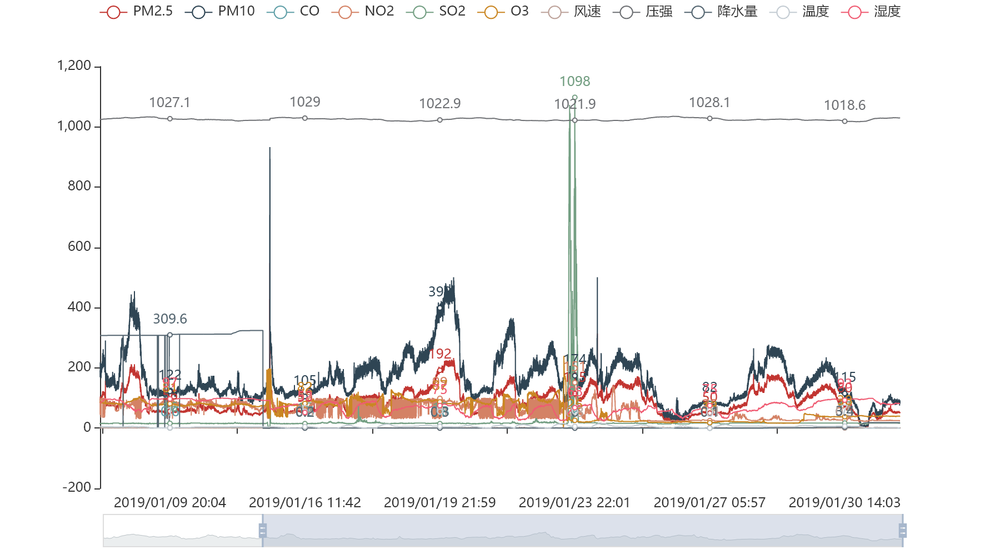

# 取出excel数据生成图表

- 帮朋友写的一个小脚本
- 从excel中取出数据，然后生成一个统计图表
- 借助了Python的第三方模块xlrd和pyecharts

## xlrd

- Python中用来读取excel数据的模块
- 安装`pip install xlrd`
- [xlrd文档](https://xlrd.readthedocs.io/en/latest/)

## pyecharts

- Echarts 是一个由百度开源的数据可视化，凭借着良好的交互性，精巧的图表设计，得到了众多开发者的认可。
- pyecharts就是通过Python使用Echarts。
- 安装`pip install pyecharts`
- **注意**：
    - 现在有很多网上的使用pyecharts的版本都是v0.5.x的，现在安装都是v1版本的，两者差别还是蛮大的。
    - pyecharts 分为 v0.5.X 和 v1 两个大版本，v0.5.X 和 v1 间不兼容，v1 是一个全新的版本
    - [pyecharts v1版本文档](https://pyecharts.org/#/zh-cn/intro)

## 代码分析

```python
# 打开存储数据的excel
data = xlrd.open_workbook('C:\\Users\\Administrator\\Desktop\\新建文件夹\\个人-月\\12.xlsx')

# 以表格的形式取出数据
table = data.sheets()[0]

# 取出表格中第一列数据 
PM2_5 = table.col_values(0)

# 生成一个折线统计图对象
line = Line()
# 添加 x 轴元素
line.add_xaxis(handle_time_list(time[1:]))
# 添加 y 轴元素
line.add_yaxis('PM2.5', PM2_5[1:])

# 渲染到html页面
line.render('./person/12.html')
```

- 代码很简单，就是表格中的数据较多。
- 